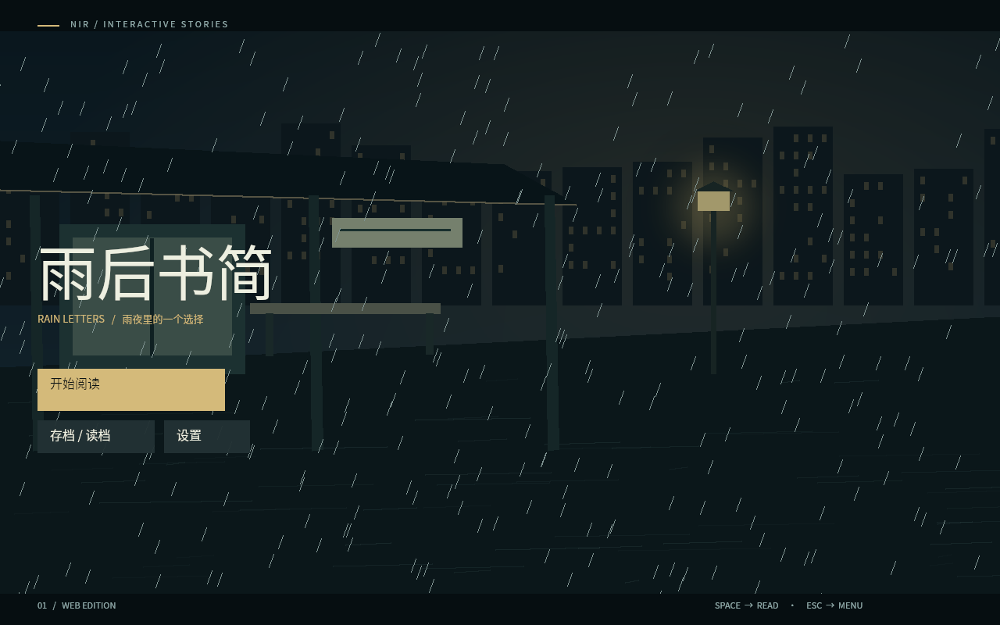
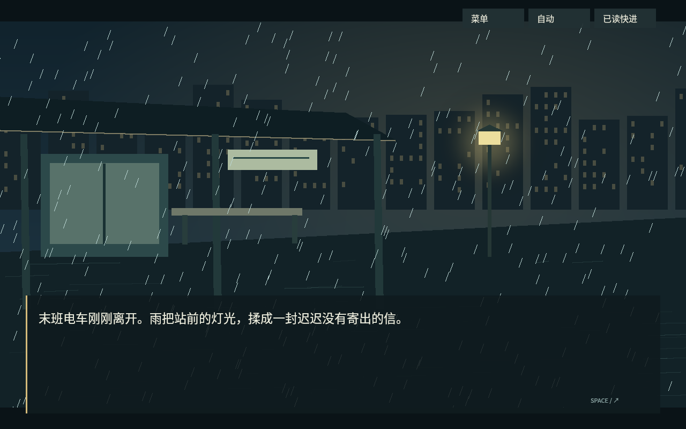
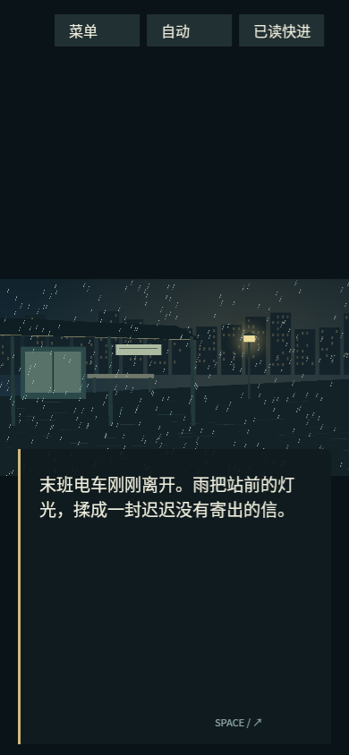

# NIR 早期验收报告

此页保留 2026-09-21 的历史结果。M4 实现与本轮验收见 [发行与桌面渲染](M4-RELEASE.md)。

测试日期：2026-09-21。测试对象为最终静态目录 `dist/rain-letters-web/`，发行身份：

`c9e03ed6eb57c7cb96d47b673b3722278bcb36924a5463da5b79da06e214a143`

## 结果

| 验证 | 结果与范围 |
|---|---|
| 原生自动测试 | 45 项通过，0 失败 |
| 真实浏览器 | 10 项通过，0 跳过、0 失败、0 flaky；用时 104.6 秒 |
| Rust 格式 / lint | fmt 通过；原生与 WASM 自有代码 Clippy `-D warnings` 通过 |
| WASM / SDK | 固定依赖 release 构建成功，wasm-bindgen 0.2.100 |
| 依赖边界 | 12 个工作区包；无核心到 Web/GPU 依赖，无播放器到编译器依赖 |
| 独立 SDK | 不带源码、无 Cargo PATH，init/resolve/doctor/check/test/build 成功 |
| 可复现内容 | 相同输入在两个目录产生相同发行及对象身份；独立作品重复构建同样一致 |
| 发行完整性 | 12 个对象，逐一验证 SHA-256 与尺寸；真实 WASM 魔数及引用闭包通过 |
| 锁与部署 | SDK 漂移被拒绝；真实子路径启动、WASM MIME、不可变缓存、丢失对象 404 通过 |

原生测试覆盖确定 trace、I32 溢出和错误位置、随机流恢复、确定赋值、无限循环预算、失败优先于取消的 All、同批输入优先于超时、旧点击、Gate 契约、PendingActivation 恢复不重做前置赋值、动画 37% 恢复、独立暂停原因、连续回退、候选读档、会话切换后的保存回执、设备损失期间的候选恢复、路径/符号链接逃逸、重复身份、LFS 指针、缺字、损坏对象、执行索引及资源配方。

浏览器实际执行了 Rust WASM 与 WebGPU，检查画布 PNG 的像素范围和颜色多样性，并人工查看标题、中文对白、选项、两条结局、设置、回看、转场和窄屏截图。两条路线分别到达 `walk_home` 与 `read_letter`，变量断言符合用例。

浏览器还覆盖了 IndexedDB 保存后刷新、暂停读档、语言切换保留当前正文、回退、正文/界面尺寸变化、独立菜单/后台暂停、实际标签页 `visibilitychange`、真实 GPUDevice 销毁与重建、转场进度保持、加载失败重试、损坏 WASM 启动前拒绝、存档文件导出/导入与篡改拒绝。触摸测试发送 Chromium 触摸事件到绘制按钮和对白区。

## 环境与测量

- 浏览器：Chromium 153.0.8010.52 Arch Linux，有窗口模式；测试启动参数包含 `--enable-unsafe-webgpu`。
- 实际适配器：`google / swiftshader`，`isFallbackAdapter=true`。这是软件 WebGPU，不能作为物理 GPU 成绩。
- 桌面视口：1280 × 800；触摸/窄屏：390 × 844。触摸是浏览器仿真，未使用移动真机。
- 工具：Rust 1.95.0、Node.js 24.21.0、Playwright 1.63.0，Linux x86_64。

| 单次自动通关测量 | 数值 |
|---|---|
| 宿主启动到标题可显示 | 2958.0 ms |
| 宿主启动到首句 | 4809.8 ms，包含测试等待及点击之前的时间 |
| 首次开始输入到首句 | 271.7 ms |
| 两条路线累计 GPU 帧提交 | 70 |
| 标题静置 600 ms | 无新增 GPU 帧提交 |
| 资源准入估算峰值 | 67,160,180 字节（64.05 MiB） |
| 未压缩运行对象合计 | 6,676,940 字节 |
| 音频启动 | 6 次，使用真实 Web Audio 解锁、播放与结束事件 |

这些是本机一次开发环境实测，不是统计基准；标题计时起点在 JS 宿主进入后，未完整包含导航与 WASM 下载。资源峰值是应用联合账本的保守准入量，包含预留表面/字体/检查点预算，不是进程 RSS、驱动分配或硬件显存峰值。没有报告未测量的硬件帧率。

## 明确未验证 / 未实现

- 未验证物理 GPU、移动真机、Safari/Firefox、读屏器实机、跨操作系统 CLI 和外部 CDN 上线。
- 音频完成事件已验证，未作真人听音或音质验收；示例 voice 是合成测试声音。
- 浏览器存储配额耗尽、多标签页同时保存的完整端到端压力测试、长时间内存压力测试未执行。修订冲突处理及预算准入有实现，不能据此宣称完整环境认证。
- 语言包在单模块内预装；验证过无效语言保留旧状态，没有远程语言包下载失败场景。
- WebGL2、Worker、Ruby、NVL、多模块按需加载、安全热更新、PWA、高级优化均不在本次交付中；其他边界见 [能力表](CAPABILITIES.md)。
- 本机无界面 Chromium 的 WebGPU 合成曾出现空画布；使用有窗口模式完成上述验收。不能将无界面的成功提交当作可见画面通过。
- vendored wgpu 的两个已有 unused-import warning 保留；自有代码的严格 lint 通过。

## 可查证据

[原生测试](validation/native-tests.log) · [浏览器结果](validation/browser-results.json) · [浏览器日志](validation/browser-run.log) · [实测数据](validation/browser-metrics.json) · [独立 SDK](validation/standalone-sdk.json) · [发行校验](validation/final-release-verification.json) · [构建与素材来源](validation/build.json)

